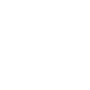
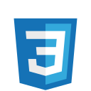
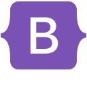
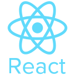
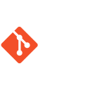
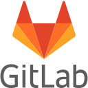
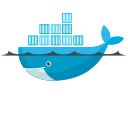

        <h1 class="main_text">Hi! I am Pavel</h1>
        
🌱 i am FullStack developer on python, 
        java and golang programming language

        
👀 I have been writing in python since 2020

        
📫 I'm learning new things everyday.

# 🛠️ Skills
## Back-End

> 
>  
  
  
  
 

## Databases
>  
  
  

## Front-end

> 
 
 
 

## Tools
> 
 
>  
>  
>  
>  
>  
>  
>   
> 

## About my Github:

